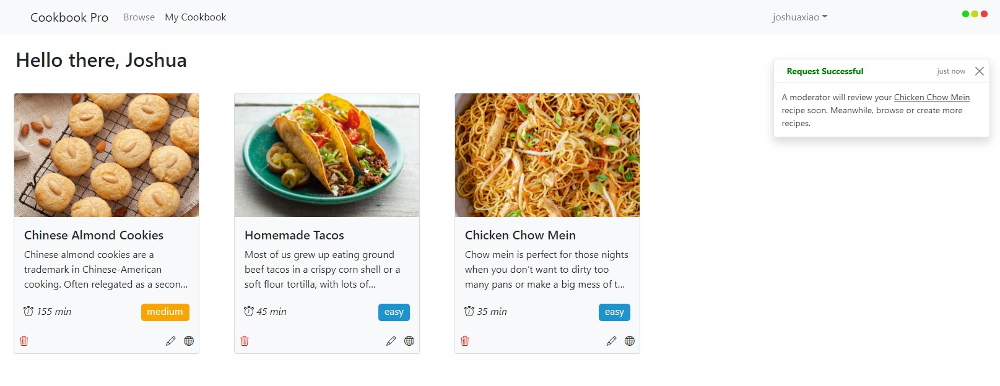

Try the demo out [here](https://cookbookpro.netlify.app/).

# Cookbook Pro

Cookbook Pro fosters a community of home cooks from all walks of life to grow their confidence in writing food recipes.

 Whether you're an inexperienced 10 year old who just watches too much MasterChef or an expert chef with knowledge stretching all the way from pastry to fine dining, Cookbook Pro is the platform made for you to create, share, and browse through diverse dishes. 
 
 Find your next favourite recipe or contribute to our growing collection of recipes, the choice is yours. But whatever you choose to do, just keep on cookin'!

 ### Inspiration
 As a busy university student who cooks three daily meals, I needed a creative way to organize my recipes so that I could quickly reference the ingredients or instructions if I ever got lost. I also rotate between the same four meals, which can be quite boring sometimes. I wanted to expand my cook book and learn new dishes from other home cooks. Cookbook Pro is the solution to these problems.
